# 🤖 Business AI Agent — RAG-Powered Sales Assistant

<p align="center">
  
  
  
  
  
  
</p>

> A **24/7 AI sales agent** that reads your business data (PDFs, websites, raw text) and converts visitors into booked appointments — in **Hindi or English** — powered by 100% free AI APIs.

---

## ✨ Features

| Feature | Description |
|---|---|
| 🧠 **RAG Engine** | Reads your business docs and answers only from your data |
| 🤖 **Free LLM** | Groq's `llama-3.1-8b-instant` — no paid API needed |
| 💬 **Bilingual Chat** | Auto-detects Hindi / English and replies accordingly |
| 🎤 **Voice Input** | Web Speech API — speak your question |
| 📎 **PDF Upload in Chat** | Upload PDFs directly from the chat window |
| 📅 **Auto Appointment Booking** | Detects booking intent and saves lead to local DB |
| ⚙️ **Admin Panel** | Ingest data (PDF/URL/text) + manage bookings |
| ✅ **Booking CRUD** | Confirm / Cancel / Delete bookings + Export CSV |
| 🔍 **Semantic Search** | Finds answers even with typos or paraphrased queries |
| 🛡️ **Privacy First** | All API keys in `.env` — never committed to Git |

---

## 🗺️ System Architecture & Flowchart

```mermaid
flowchart TD
    User(["🧑 User / Visitor"])
    Admin(["🔧 Business Admin"])

    subgraph Frontend ["⚛️ Next.js Frontend (Port 3000)"]
        CW["💬 Chat Window\n(voice + text input)"]
        AP["⚙️ Admin Panel\n(ingest + bookings)"]
        BM["📅 Booking Modal"]
        QR["⚡ Quick Replies"]
    end

    subgraph API ["🔀 Next.js API Routes (Proxy)"]
        RC["/api/chat"]
        RI["/api/ingest/pdf | url | text"]
        RB["/api/book  /api/bookings"]
        RV["/api/vectorstore/reset"]
    end

    subgraph Backend ["🐍 FastAPI Backend (Port 8000)"]
        CE["Chat Endpoint\n/api/chat"]
        IE["Ingest Endpoint\n/api/ingest/*"]
        BE["Booking Endpoint\n/api/book"]
        AE["Admin Endpoint\n/api/bookings CRUD"]
    end

    subgraph RAG ["🧠 RAG Engine"]
        EMB["HuggingFace Embeddings\nall-MiniLM-L6-v2 (local)"]
        VDB[("🗄️ ChromaDB\nVector Store")]
        LLM["🤖 Groq LLM\nllama-3.1-8b-instant (FREE)"]
        HIST["📜 Chat History\n(session memory)"]
    end

    subgraph Storage ["💾 Local Storage"]
        BJ["📋 bookings.json\n(leads / appointments)"]
        DOCS["📁 business_docs/\n(PDFs, data)"]
    end

    User -->|types / speaks| CW
    User -->|clicks| QR
    CW --> RC
    QR --> RC
    RC --> CE
    CE --> EMB
    EMB -->|similarity search| VDB
    VDB -->|top-k chunks| CE
    CE --> HIST
    HIST --> LLM
    LLM -->|answer + intent| CE
    CE -->|booking_triggered=true| BM
    BM --> RB --> BE --> BJ

    Admin -->|upload PDF / URL / text| AP
    AP --> RI --> IE --> EMB
    EMB -->|store embeddings| VDB
    IE --> DOCS

    Admin -->|view / confirm / delete| AP
    AP --> RB --> AE --> BJ
    AP --> RV --> VDB
```



---

## 🗂️ Project Structure

```
business-ai-agent/
├── backend/
│   ├── main.py             # FastAPI app + all REST endpoints
│   ├── rag_engine.py       # RAG pipeline (Groq LLM + ChromaDB + embeddings)
│   ├── document_loader.py  # PDF / URL / raw-text ingestion
│   ├── appointment.py      # Booking CRUD (JSON store)
│   ├── seed_data.py        # Optional: seed sample business data
│   ├── requirements.txt    # Python dependencies
│   └── data/
│       ├── business_docs/  # Drop your PDFs here
│       └── chroma_db/      # Auto-generated vector store (git-ignored)
│
├── frontend/
│   ├── app/
│   │   ├── page.tsx        # Main page (chat + admin toggle)
│   │   ├── layout.tsx      # Root layout
│   │   └── api/            # Next.js proxy routes → FastAPI
│   │       ├── chat/
│   │       ├── ingest/{pdf,url,text}/
│   │       ├── book/
│   │       ├── bookings/[id]/{status}/
│   │       └── vectorstore/reset/
│   ├── components/
│   │   ├── ChatWindow.tsx  # Chat UI with voice, PDF upload, quick replies
│   │   ├── AdminPanel.tsx  # Data ingestion + booking management
│   │   ├── BookingModal.tsx
│   │   ├── MessageBubble.tsx
│   │   └── TypingIndicator.tsx
│   └── package.json
│
├── .env.example            # ← Copy to .env and fill your keys
├── frontend/.env.example   # ← Copy to frontend/.env.local
├── .gitignore
└── README.md
```

---

## 🚀 Quick Start

### 1. Clone the Repository

```bash
git clone https://github.com/aniketsahu07/business-ai-agent.git
cd business-ai-agent
```

### 2. Get Free API Keys

| Service | Link | What for |
|---|---|---|
| **Groq** | https://console.groq.com/keys | LLM (llama-3.1-8b-instant) — 100% FREE |
| **HuggingFace** | https://huggingface.co/settings/tokens | Embeddings download |

### 3. Configure Environment Variables

```bash
# Backend
cp .env.example .env
```

Edit `.env`:
```env
HUGGINGFACE_API_TOKEN=hf_your_token_here
HF_TOKEN=hf_your_token_here
GROQ_API_KEY=gsk_your_key_here
LLM_MODEL=llama-3.1-8b-instant
NEXT_PUBLIC_BUSINESS_NAME=Your Business Name
NEXT_PUBLIC_AGENT_NAME=Aria
```

```bash
# Frontend
cp frontend/.env.example frontend/.env.local
```

### 4. Start the Backend

```bash
# Create and activate conda environment
conda create -n rag_agent python=3.11 -y
conda activate rag_agent

# Install dependencies
cd backend
pip install -r requirements.txt

# Run FastAPI server
uvicorn main:app --host 0.0.0.0 --port 8000 --reload
```

Backend will be live at → **http://localhost:8000**  
API docs at → **http://localhost:8000/docs**

### 5. Start the Frontend

```bash
cd frontend
npm install
npm run dev
```

Frontend will be live at → **http://localhost:3000**

---

## 📡 API Reference

| Method | Endpoint | Description |
|---|---|---|
| `POST` | `/api/chat` | Send message, get AI response |
| `POST` | `/api/ingest/pdf` | Upload PDF file |
| `POST` | `/api/ingest/url` | Scrape & index a webpage |
| `POST` | `/api/ingest/text` | Index raw text (FAQs, pricing etc.) |
| `POST` | `/api/book` | Create a new appointment/lead |
| `GET` | `/api/bookings` | List all bookings |
| `PATCH` | `/api/bookings/{id}/status` | Update booking status |
| `DELETE` | `/api/bookings/{id}` | Delete a booking |
| `DELETE` | `/api/vectorstore/reset` | Wipe all indexed data |

---

## ⚙️ Admin Panel Guide

### 📄 Data Ingestion Tab
| Action | How |
|---|---|
| Upload PDF | Click the dashed area, select `.pdf` file |
| Scrape URL | Paste URL (pricing page, about page) → click **Index** |
| Paste Text | Type/paste FAQs, service info → click **Index Text** |
| Reset KB | Click **Reset entire knowledge base** (irreversible) |

### 📅 Bookings Tab
| Button | Action |
|---|---|
| ✅ Green tick | Mark booking as **Confirmed** |
| 🔄 Amber rotate | Revert back to **Pending** |
| ❌ Orange X | Mark as **Cancelled** |
| 🗑️ Red trash | **Permanently delete** booking |
| 📥 Export CSV | Download all bookings as `.csv` |

---

## 🛠️ Tech Stack

| Layer | Technology |
|---|---|
| **Frontend** | Next.js 16, React 18, Tailwind CSS, Framer Motion |
| **Backend** | FastAPI, Uvicorn, Pydantic |
| **LLM** | Groq API — `llama-3.1-8b-instant` (FREE tier) |
| **Embeddings** | HuggingFace `sentence-transformers/all-MiniLM-L6-v2` (local) |
| **Vector DB** | ChromaDB (local persistent) |
| **RAG Framework** | LangChain (langchain-core, langchain-community, langchain-groq) |
| **PDF Parsing** | pypdf |
| **Web Scraping** | BeautifulSoup4, requests |

---

## 🔒 Security & Privacy

- ✅ All API keys stored in `.env` — **never committed** to Git
- ✅ `.gitignore` covers `.env`, `.env.*`, `chroma_db/`, `bookings.json`
- ✅ Use `.env.example` as safe template for sharing
- ✅ CORS locked to same-origin in production

---

## 🤝 Contributing

1. Fork the repo
2. Create feature branch: `git checkout -b feat/your-feature`
3. Commit with clear message: `git commit -m "feat: add xyz feature"`
4. Push: `git push origin feat/your-feature`
5. Open a Pull Request

---

## 📄 License

MIT © [Aniket Sahu](https://github.com/aniketsahu07)


> A 24/7 AI sales assistant that reads **your** business data (PDFs, websites, text)
> and converts visitors into booked appointments — in Hindi or English.

---

## Architecture

```
┌─────────────────────────────────────────────────────┐
│                  Next.js Frontend                    │
│  Chat UI  |  Booking Modal  |  Admin Panel           │
└───────────────────┬─────────────────────────────────┘
                    │ REST API
┌───────────────────▼─────────────────────────────────┐
│               FastAPI Backend                        │
│  /api/chat   /api/ingest/*   /api/book   /api/book.. │
└──────┬──────────────────┬───────────────────────────┘
       │                  │
  ┌────▼────┐       ┌─────▼──────┐
  │ ChromaDB │       │ HuggingFace│
  │ (local)  │       │ Inference  │
  │ Vectors  │       │ API (LLM)  │
  └──────────┘       └────────────┘
       ▲
  HuggingFace Embeddings
  (sentence-transformers, local)
```

---

## Quick Start

### 1. Clone / Open the project

```bash
cd "c:\rag model"
```

### 2. Set up your HuggingFace token

1. Create a free account at https://huggingface.co
2. Go to **Settings → Access Tokens** → create a **Read** token
3. Edit `.env` and paste your token:

```env
HUGGINGFACE_API_TOKEN=hf_xxxxxxxxxxxxxxxxxxxx
```

### 3. Backend Setup

```bash
cd backend

# Create virtual environment
python -m venv venv
venv\Scripts\activate        # Windows
# source venv/bin/activate   # Linux/Mac

# Install dependencies
pip install -r requirements.txt

# Seed your business data (edit seed_data.py first!)
python seed_data.py

# Start the API server
uvicorn main:app --reload --port 8000
```

The API will be at: http://localhost:8000  
Swagger docs: http://localhost:8000/docs

### 4. Frontend Setup

```bash
cd ..\frontend

# Install packages
npm install

# Start dev server
npm run dev
```

Open: http://localhost:3000

---

## Customising for Your Business

### Step 1 – Edit Business Data (`backend/seed_data.py`)

Replace the `BUSINESS_INFO` string with your real data:
- Business name & location
- Services & pricing
- FAQs
- Team members
- Special offers

Then re-run:
```bash
python seed_data.py
```

### Step 2 – Upload PDFs via Admin Panel

1. Open http://localhost:3000
2. Click **Admin** (top right)
3. Upload PDFs or paste text in the **Data Ingestion** tab

### Step 3 – Change the LLM (optional)

Edit `.env`:
```env
# Faster, lighter:
LLM_MODEL=google/flan-t5-xxl

# Better quality (recommended):
LLM_MODEL=mistralai/Mistral-7B-Instruct-v0.2

# Good chat-tuned model:
LLM_MODEL=HuggingFaceH4/zephyr-7b-beta
```

### Step 4 – Brand the UI

In `.env`:
```env
NEXT_PUBLIC_BUSINESS_NAME=Your Gym Name
NEXT_PUBLIC_AGENT_NAME=Maya
NEXT_PUBLIC_PRIMARY_COLOR=#6366f1
```

---

## Features

| Feature | Status |
|---|---|
| Semantic search over business data | ✅ |
| Multi-turn conversation memory | ✅ |
| Hindi + English auto-detection | ✅ |
| Intent detection (booking / pricing / query) | ✅ |
| In-chat appointment booking | ✅ |
| PDF ingestion | ✅ |
| URL/blog scraping | ✅ |
| Admin panel (ingest + view leads) | ✅ |
| ChromaDB persistent vector store | ✅ |
| HuggingFace free tier LLM | ✅ |
| Source citation in responses | ✅ |

---

## API Reference

| Method | Endpoint | Description |
|---|---|---|
| POST | `/api/chat` | Send a chat message |
| POST | `/api/ingest/pdf` | Upload & index a PDF |
| POST | `/api/ingest/url` | Scrape & index a URL |
| POST | `/api/ingest/text` | Index raw text |
| POST | `/api/book` | Save a lead/appointment |
| GET  | `/api/bookings` | List all leads (admin) |
| DELETE | `/api/vectorstore/reset` | Clear all indexed data |

Full interactive docs: http://localhost:8000/docs

---

## Extending the Project

### Google Calendar Integration
In `backend/appointment.py`, after saving to JSON, add:
```python
from googleapiclient.discovery import build
# ... create event using Google Calendar API
```

### WhatsApp Notifications
Add Twilio WhatsApp API call in `create_booking()`:
```python
from twilio.rest import Client
client = Client(TWILIO_SID, TWILIO_TOKEN)
client.messages.create(to="whatsapp:+91...", from_="whatsapp:+1...", body=f"New booking: {name}")
```

### Deploy to Production
- Backend: **Railway** or **Render** (free tier)
- Frontend: **Vercel** (free tier, one-click deploy)
- Set `NEXT_PUBLIC_API_URL` env var in Vercel to your Railway URL

---

## Tech Stack

| Layer | Technology |
|---|---|
| Frontend | Next.js 14, TypeScript, Tailwind CSS |
| Backend | FastAPI, Python 3.11+ |
| AI Workflow | LangChain |
| Embeddings | `sentence-transformers/all-MiniLM-L6-v2` (HuggingFace, local) |
| LLM | HuggingFace Inference API (Mistral-7B / Flan-T5) |
| Vector DB | ChromaDB (local persistent) |
| Data parsing | PyPDF, BeautifulSoup4 |
| Memory | ConversationBufferWindowMemory (per session) |
